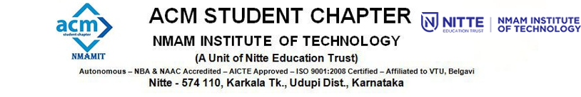

# 

# **ACM NMAMIT Student Chapter**

Welcome to the official GitHub organization for the **NMAMIT ACM Student Chapter**. We are part of the **Association for Computing Machinery (ACM)**, the world’s largest educational and scientific computing society. Since our chapter's inception in **May 2015**, we have been committed to fostering a vibrant community where students from **All Streams** can collaborate, innovate, and excel in computing.

---

## 🌟 **Our Vision**

We are driven by ACM’s mission to advance computing as both a science and a profession. Our goal is to create a platform for students to explore new technologies, hone their technical skills, and collaborate on groundbreaking projects.

---

## 📋 **Our Focus Areas**

We organize our efforts into four core segments to ensure efficient execution and continuous growth:

### 1. **Program Management**
   - **Objective**: Plan, execute, and promote ACM events to a wide audience.
   - **Tasks**:
     - Organizing coding competitions, workshops, webinars, and hackathons.
     - Ensuring broad reach and visibility across the student community.

### 2. **Creativity & Design**
   - **Objective**: Innovate and design promotional content for ACM events.
   - **Tasks**:
     - Designing posters, banners, brochures, and digital content.
     - Conceptualizing new, creative event ideas that push boundaries.

### 3. **Technical Team**
   - **Objective**: Spearhead technical content creation and event execution.
   - **Tasks**:
     - Preparing content for technical events and workshops.
     - Leading **Special Interest Groups (SIGs)** in trending fields such as:
       - **Artificial Intelligence**
       - **Cybersecurity**
       - **Blockchain**
       - **Web Development**
     - Evaluating participants and formulating challenges for coding competitions.

### 4. **Documentation & Media**
   - **Objective**: Preserve and present a visual and written history of our activities.
   - **Tasks**:
     - Capturing event photos and videos.
     - Preparing reports, documentation, and media for future reference.

---

## 🚀 **Our Events**

Our chapter prides itself on hosting a variety of engaging and educational events:

- **Hands-on Workshops**: Covering the latest technologies like **AI**, **Blockchain**, and **Cybersecurity**.
- **Coding Competitions & Hackathons**: Challenging participants to solve real-world problems.
- **Guest Lectures & Webinars**: Delivered by industry experts and ACM alumni.
- **Special Interest Groups (SIGs)**: Focused sessions to dive deep into specialized domains like **Machine Learning**, **Cloud Computing**, and more.

---

## 🎨 **Get Involved**

The ACM NMAMIT Student Chapter offers students a platform to grow academically and professionally. Whether you're passionate about coding, design, event management, or research, there’s something for you here!

### Why Join Us?
- **Collaborate** with like-minded individuals on exciting projects.
- **Learn** cutting-edge technologies through SIGs and workshops.
- **Lead** by organizing events and managing teams.
- **Network** with professionals, alumni, and global ACM members.
- **Build Your Portfolio**: Contribute to open-source projects hosted on our GitHub.

---

## 💼 **Our Teams**

At ACM NMAMIT, we operate through a collaborative structure with dedicated teams:

- **Technical Team**: For tech enthusiasts who love coding and problem-solving.
- **Design & Creativity Team**: For students passionate about creating visually appealing designs and promotional materials.
- **Program Team**: For those who enjoy planning, coordinating, and managing events.
- **Documentation Team**: For the storytellers who capture the essence of every event through photography, videography, and writing.

---

## 🌐 **Connect with Us**

Stay updated with our upcoming events, workshops, and projects through our social media and official communication channels:

- **[ACM NMAMIT Website](https://nmamit.acm.org/)** (Coming Soon)
- **[Instagram](https://www.instagram.com/acm_nitte/)**
- **[LinkedIn](https://www.linkedin.com/company/acm-nmamit/)**

---

## 📞 **Contact Us**

For any queries, collaborations, or membership information, feel free to reach out:
- 📧 **Email**: acm.nmamit@gmail.com
- 📍 **Location**: NMAM Institute of Technology, Karnataka, India

---

## 🤝 **Contributing to This Repository**

We welcome contributions! If you're an ACM NMAMIT member, feel free to fork this repository, create new projects, or work on existing ones. Be sure to follow our [Contribution Guidelines](#) and adhere to the code of conduct.

---

## 📝 **License**

This repository is licensed under the [MIT License](LICENSE). Feel free to use and contribute to the projects available here.

---

Thank you for visiting the **ACM NMAMIT Student Chapter** GitHub! We look forward to collaborating with you.

